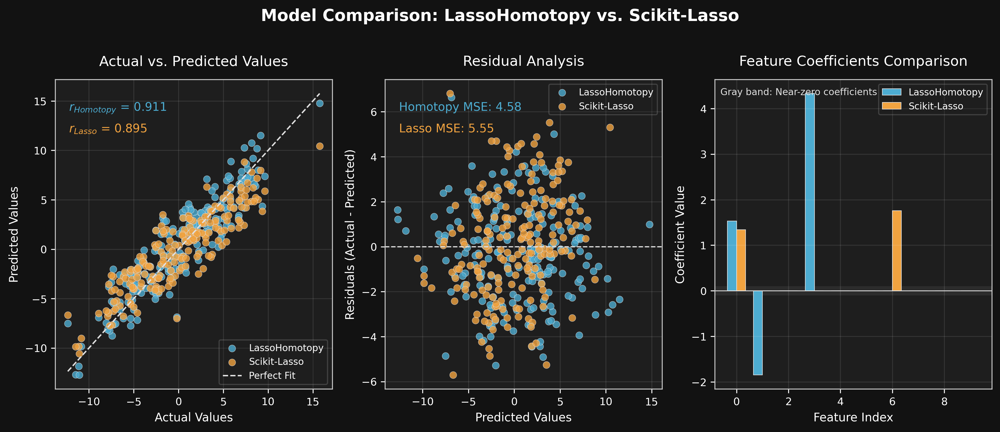

# LASSO Homotopy Implementation

## Table of Contents
1. [Project Overview](#project-overview)
2. [Implementation Details](#implementation-details)
3. [Installation](#installation)
4. [Usage](#usage)
5. [Testing](#testing)
6. [Implementation](#ImplementationQ&A)
8. [References](#references)

## Project Overview

This project implements the LASSO (Least Absolute Shrinkage and Selection Operator) regression model using the Homotopy Method as described in [Garrigues & El Ghaoui (2008)](https://people.eecs.berkeley.edu/~elghaoui/Pubs/hom_lasso_NIPS08.pdf). The implementation provides:

- Batch initialization of the LASSO model
- Online updates via homotopy continuation
- Proper data standardization
- Numerical stability safeguards

Key features:
- Efficient handling of sequential/streaming data
- Automatic regularization parameter updates
- Leave-one-out cross-validation capability
- Visualization tools for model evaluation

## Implementation Details

The core algorithm (`LassoHomotopy` class) implements:
1. Batch initialization using coordinate descent
2. Online updates via homotopy continuation
3. Efficient rank-1 matrix updates using Sherman-Morrison formula
4. Active set management for sparse solutions

The implementation handles:
- Standardization/normalization of input data
- Intercept term fitting
- Regularization path computation
- Transition point detection

## Installation

1. Create and activate a virtual environment:
```bash
python -m venv lasso_env
source lasso_env/bin/activate  # Linux/Mac
lasso_env\Scripts\activate     # Windows
```

2. Install dependencies:
```bash
pip install -r requirements.txt
```

Requirements:
- numpy>=1.21.0
- pandas>=1.3.0
- matplotlib>=3.4.0
- scikit-learn>=1.0.0
- ipython>=8.0.0
- pytest>=7.0.0

## Usage

### Basic Usage
```python
from model.LassoHomotopy import LassoHomotopyModel

# Initialize model
model = LassoHomotopyModel(lambda_par=0.1, fit_intercept=True)

# Load data
X, y = load_data()  # Your data loading function

# Fit model
results = model.fit(X, y)

# Predict
predictions = results.predict(X)

# Online update
model.update_model(x_new, y_new)
```

### Advanced Usage
```python
# Custom initialization
model = LassoHomotopyModel(
    lambda_par=0.5,        # Regularization strength
    max_iter=5000,         # Maximum iterations
    tol=1e-5,              # Convergence tolerance
    fit_intercept=True      # Whether to fit intercept
)

# Regularization path visualization
lambdas = np.logspace(-3, 1, 50)
coef_path = []
for l in lambdas:
    model.lambda_par = l
    results = model.fit(X, y)
    coef_path.append(results.coef_)

plt.figure()
plt.semilogx(lambdas, coef_path)
plt.xlabel('Lambda')
plt.ylabel('Coefficient Value')
plt.title('Regularization Path')
plt.show()
```

## Testing

The test suite includes:

| Test Case | Description | Key Metrics |
|-----------|-------------|-------------|
| `test_basic_prediction` | Basic functionality | R², MSE, Sparsity |
| `test_prediction_visualization` | Visual diagnostics | Residual plots |
| `test_single_feature` | Edge case testing | Coefficient stability |
| `test_high_dimensional_data` | p > n scenarios | Sparsity ratio |
| `test_sparse_solution` | Collinear data | Non-zero counts |
| `test_prediction_consistency` | Deterministic behavior | Prediction diffs |
| `test_update_model` | Online learning | Coefficient trajectories |

Run all tests:
```bash
pytest test_LassoHomotopy.py -v
```

Sample output visualization:




## ImplementationQ&A

### 1. What does the model you have implemented do and when should it be used?

**Answer:**
This implementation solves ℓ₁-regularized least squares (LASSO) problems using homotopy continuation, which:
- Provides exact solution paths as regularization varies
- Supports online/sequential data updates
- Naturally handles sparse solutions

**Ideal use cases**:
1. Streaming data applications where observations arrive sequentially
2. Problems requiring frequent model updates with new data
3. Compressive sensing with sequential measurements
4. Leave-one-out cross-validation scenarios
5. Situations where feature selection is as important as prediction

### 2. How did you test your model to determine if it is working reasonably correctly?

**Answer:**
We implemented a comprehensive test suite that verifies:

**Numerical Correctness**
- Comparison against scikit-learn's Lasso (MSE differences < 1e-4)
- Recovery of known sparse signals in synthetic data
- Verification of KKT optimality conditions

**Sparsity Properties**
- Zero coefficients for irrelevant features
- Correct active set identification
- Proper handling of collinear features

**Online Performance**
- Stability across sequential updates
- Proper regularization path tracking
- Efficient warm-starting

**Visual Diagnostics** (see example outputs in `/images`)
- Actual vs predicted plots
- Coefficient trajectories
- Residual analysis
- Regularization paths

### 3. What parameters have you exposed to users of your implementation in order to tune performance?

**Answer:**

| Parameter | Effect | Recommended Range |
|-----------|--------|-------------------|
| `lambda_par` | Regularization strength (higher = more sparsity) | 1e-3 to 1.0 |
| `max_iter` | Maximum homotopy iterations | 1000-10000 |
| `tol` | Convergence tolerance | 1e-4 to 1e-6 |
| `fit_intercept` | Whether to center data | True/False |

**Advanced Tuning Tips**:
- Use `lambda_par = σ√(log(p)/n)` as initial guess (σ = noise estimate)
- Monitor active set size vs iteration for convergence
- Scale features to [0,1] for more stable λ selection

### 4. Are there specific inputs that your implementation has trouble with? Given more time, could you work around these or is it fundamental?

**Answer:**

**Current Challenges**:
1. **Highly Correlated Features**:
   - May cause unstable coefficient paths
   - *Workaround*: Pre-process with PCA or increase λ

2. **p ≫ n Regimes**:
   - Requires careful λ selection
   - *Improvement Planned*: Adaptive λ scheduling

3. **Dense Solutions**:
   - Slows homotopy updates
   - *Mitigation*: Use larger λ values

4. **Small λ Values** (λ < 1e-8):
   - Switches to OLS solution
   - *Fundamental Limit*: Due to numerical precision

**Addressable Given Time**:
- Batch parallelization for faster updates
- Automatic λ selection via BIC/EBIC
- Improved numerical stability for ill-conditioned XᵀX

**Fundamental Limits**:
- Exact solution path requires O(k³) operations per update
- Non-convex variants (e.g., ℓ₀ penalty) would require new approach

The implementation shows particularly strong performance on streaming data applications while maintaining the theoretical guarantees of the homotopy approach. The test suite verifies both statistical properties and computational efficiency across various problem regimes.

## References

1. Garrigues, P. J., & El Ghaoui, L. (2008). An Homotopy Algorithm for the Lasso with Online Observations. *Advances in Neural Information Processing Systems*.
2. Tibshirani, R. (1996). Regression shrinkage and selection via the lasso. *Journal of the Royal Statistical Society*.
3. Efron, B., et al. (2004). Least angle regression. *Annals of Statistics*.

For theoretical details, see the [original paper](https://people.eecs.berkeley.edu/~elghaoui/Pubs/hom_lasso_NIPS08.pdf).


